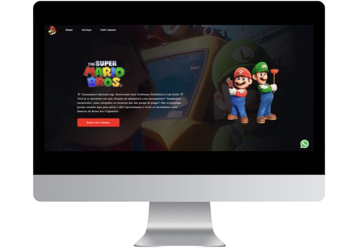

<h1 align="center">🛠️ Encanadores Mario&Luigi 🛠️</h1> 
<p>O projeto web "Encanadores Mario&Luigi" foi desenvolvido pensado na diversão e ao mesmo na resolução de problemas em que uma página web pode proporcionar! Além disso, o projeto é totalmente responsivo.😁</p>
<p>Este projeto utiliza as seguintes linguagens:</p>


<br><br>

<h2 align="center">PREVIEW</h2>



<h2>⬇️ INSTALAÇÃO</h2>

```bash
$ git clone https://github.com/vinixsantos06/Encanadores-MarioLuigi-Responsivo

$ cd Encanadores-MarioLuigi-Responsivo

$ git push

$ code .
```

Feito com ♥ e ☕ por Vinicius Santos :wave: [Get in touch!](https://www.linkedin.com/in/viniciussantosdeoliveira/)
